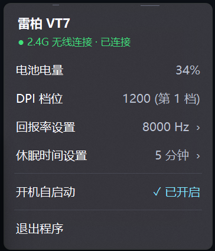

<div align="center">
  
  <h1>rapoo-tray</h1>
  <p><b>雷柏VT系列游戏鼠标轻量化托盘程序</b></p>

  <p>
    <a href="https://github.com/Iris-0109/rapoo-tray/releases"></a>
    
    
    
  </p>
</div>

---

## 💡 项目简介

**rapoo-tray** 是面向雷柏（Rapoo）游戏鼠标用户的轻量化辅助工具。基于 C++17 与 Win32 API 编写，不依赖臃肿的第三方库，占用极低。程序支持以任务栏系统托盘独立运行，或作为插件集成至 [TrafficMonitor](https://github.com/zhongyang219/TrafficMonitor)，提供电量监测、DPI 显示、回报率调节、休眠配置等常用功能。

---

## 🚀 v1.2.0 核心更新

- **硬件兼容体系重构**：建立雷柏二代 Nordic 架构通用兼容机制，未打标机型自动归入通用模式，全功能 100% 完整支持；新增雷柏 VT3 MAX 型号识别。
- **托盘电池个性化**：新增 3 种展示风格：
  - **配置一（经典电池）**：采用14px，5x9 点阵高清字体，清晰醒目。
  - **配置二（状态大圆点）**：极简纯净大号无数字圆点。
  - **配置三（大号矢量数字）**：采用 4 倍超采样（SSAA）抗锯齿算法，字体无毛边。
- **DPI 动态自适应屏幕悬浮窗 (OSD)**：
  - 弃用固定宽框，改为毫秒级文本动态计算卡片宽度（`DT_CALCRECT`）。
  - 三行精简架构：`设备全称 DPI 数值` / `X 轴与 Y 轴独立分辨率` / `连接模式 | 当前档位 | 电量 | 回报率`。
  - 电量指示符号化：常规状态使用 `🔋`，充电中智能切换为 `⚡`。
- **托盘右键面板**：菜单设计成Fluent 亚克力材质；新增回报率调节、休眠配置功能。

---

## 📸 效果展示 (Showcase)

| 任务栏托盘图标 (双击循环切换 3 种样式) | OSD 屏幕自适应悬浮窗 (支持 X/Y 轴独立显示) |
| :---: | :---: |
|  &nbsp;&nbsp;  &nbsp;&nbsp; <br><sub>配置一：经典电池 &nbsp;·&nbsp; 配置二：状态圆点 &nbsp;·&nbsp; 配置三：大号数字</sub> |  |

| 原生 Fluent 亚克力右键控制面板 | 2~120 分钟连续平滑休眠滑动条 |
| :---: | :---: |
|  |  |

---

## 🖱️ 鼠标交互

| 操作手势 | 响应动作 | 视觉反馈 |
| :--- | :--- | :--- |
| **鼠标左键单击** | 唤起屏幕右下角状态指示窗 | 弹出当前设备型号、DPI、双轴数值、电量与回报率 OSD |
| **鼠标左键双击** | 循环切换托盘电池图标样式 | 在“配置一 (经典电池)”、“配置二 (圆点)”、“配置三 (大号数字)”间轮换，并弹出 OSD 提示 |
| **鼠标右键单击** | 打开 Fluent 亚克力系统菜单 | 查看真实电量、调节回报率（125Hz~8000Hz）、调节休眠时间、切换开机自启 |

---

## 🎯 功能特性

1. **极简轻量，原生低耗**：
   - 纯 Win32 API 构建，无需 .NET / Electron / WebView 依赖。
   - 运行时内存仅占用约 **20~30 MB**，空闲 CPU 占用不超过 **0.2%**。
2. **多态电池托盘图标**：
   - 智能四色指示：$\le 30\%$ 红色警示、$> 30\%$ 科技蓝/主题色、充电中翡翠绿、离线/休眠暗灰虚线或横杠。
   - 配置与样式选择自动持久化保存于 Windows 注册表。
3. **硬件级回报率与休眠控制**：
   - 支持 125Hz、250Hz、500Hz、1000Hz（标准）及 2000Hz、4000Hz、8000Hz（电竞高刷）即时切换。
   - 休眠时间支持从 2 分钟到 120 分钟连续拖动与滚轮步进微调，配置即刻下发至鼠标硬件内部寄存器。
4. **开机自启**：
   - 基于当前用户注册表 `HKCU\Software\Microsoft\Windows\CurrentVersion\Run` 实现，无需管理员权限，启动无弹窗干扰。

---

## 📋 支持设备列表 (Supported Devices)

| 设备型号 | 连接模式 | VID | PID | 支持状态 |
| :--- | :--- | :--- | :--- | :---: |
| **雷柏 VT7 系列** | 2.4G 无线接收器 | `0x24AE` | `0x1460` | ✅ 开发者实测支持 |
| **雷柏 VT7 系列** | USB 有线直连 | `0x24AE` | `0x4660` | ✅ 开发者实测支持 |
| **雷柏 VT3S 系列** | 2.4G 无线接收器 | `0x24AE` | `0x1406` / `0x1410` | ✅ 社区实测支持（由社区用户 [@hsb689](https://github.com/hsb689) 提供） |
| **雷柏 VT3S 系列** | USB 有线直连 | `0x24AE` | `0x4606` / `0x1411` | ✅ 社区实测支持（由社区用户 [@hsb689](https://github.com/hsb689) 提供） |
| **雷柏 VT3 MAX 系列** | 2.4G 无线接收器 | `0x24AE` | `0x1417` | ✅ 社区实测支持（由社区用户 [@sAchNMN](https://github.com/sAchNMN) 提供） | 
| **雷柏二代游戏鼠标 (未打标机型)** | 2.4G / USB 有线 | `0x24AE` | 通用自动匹配 | 🔑待验证 |

### 💡 通用兼容机制与型号提报指南

1. **二代 Nordic 架构全功能即插即用**：
   雷柏二代游戏鼠标（基于 Nordic 54L15 / 3950 方案）在底层通信报文协议（UsagePage `0xFF00`、Report ID `0x07` 与控制指令集）上完全统一。即使您的鼠标尚未打标，程序也会自动以 **`通用`** 模式挂载运行，**电量读取、DPI 切换、回报率设置与休眠控制均 100% 完整支持**。
2. **一键提取鼠标硬件 PID 并提交 PR（仅需 1 行代码）**：
   插入鼠标后，直接双击运行项目根目录下的 **`获取鼠标PID.bat`**（或执行 `tools/get_mouse_pid.ps1`），脚本会自动提取鼠标硬件 PID 并生成代码片段复制到剪贴板；也可在 PowerShell 中手动执行：
   ```powershell
   Get-PnpDevice -PresentOnly | Where-Object { $_.InstanceId -like "*24AE*" } | Select-Object FriendlyName, InstanceId
   ```
   在 `src/device_manager.cpp` 的 `VERIFIED_MODELS` 映射表中添加对应行（如 `{ L"14xx", L"雷柏 VT9 Pro" }`），提交 PR 即可合并！

---

## 🔌 TrafficMonitor 插件使用指南

本项目提供官方适配的 TrafficMonitor 扩展插件（`rapoo-plugin.dll`），可在系统监控软件 [TrafficMonitor](https://github.com/zhongyang219/TrafficMonitor) 的任务栏窗口与主悬浮窗中显示鼠标状态。

### 显示项目
- **鼠标电量**（例如：`M: 85%`，充电时显示为 `M: ⚡85%`）
- **鼠标 DPI**（例如：`DPI: 800`）
- **悬停信息 (Tooltip)**：鼠标悬停在监控项上可查看型号、连接模式（2.4G/USB）、详细电量与当前档位。

### 安装步骤
1. 前往 [Releases](https://github.com/Iris-0109/rapoo-tray/releases) 下载 `rapoo-plugin.dll`。
2. 将 `rapoo-plugin.dll` 放置于 TrafficMonitor 根目录下的 `plugins` 文件夹中。
3. 重启 TrafficMonitor（或在右键菜单中选择“更多功能” -> “插件管理” -> “重新加载插件”）。
4. 在“选项” -> “任务栏窗口设置”或“主窗口设置”中，勾选“鼠标电量”和“鼠标DPI”即可。

---

## 📥 下载与安装

请前往 [GitHub Releases](https://github.com/Iris-0109/rapoo-tray/releases) 下载最新发行版：

- **单文件便携版 (`rapoo-tray.exe`)**：约 370 KB，绿色免安装独立托盘程序。
- **一键安装向导 (`rapoo-tray-setup.exe`)**：约 550 KB，自动部署至本地目录，创建快捷方式并支持控制面板卸载。
- **TrafficMonitor 插件 (`rapoo-plugin.dll`)**：约 28 KB，供 TrafficMonitor 用户按需下载使用。

---

## 🔬 技术协议解析 (Protocol Reverse Engineering)

程序通过 Windows 原生 HID API 与鼠标专有端点建立通信：

### 1. 被动状态接收端点 (UsagePage: `0xFF00`, Usage: `0x0002`)
通过中断传输接收 Report ID 为 `0x07` 的 19 字节实时状态包：
- `Byte [0]`: `0x07` (Report ID)
- `Byte [1]`: 设备标识（2.4G 接收器固定为 `0x20`）
- `Byte [2]`: 当前 DPI 档位索引（从 0 开始）
- `Byte [3..4]`: X 轴 DPI 数值（16 位小端序整数）
- `Byte [5..6]`: Y 轴 DPI 数值（16 位小端序整数）
- `Byte [7]`: 活跃状态标志
- `Byte [8]`: 物理电量百分比（`0x00` ~ `0x64`，即 0% ~ 100%）

### 2. 双向控制与心跳检测通道 (UsagePage: `0xFF00`, Usage: `0x000E` / `0x000F`)
通过 33 字节 Command Report (`0x06`) 与 Feature Report (`0x08`) 实现寄存器读写与离线状态判定：
- **写入寄存器**：向 Usage `0x000E` 写入 `[0x06, 0xA5, 0xA5, 0x01, Addr, Bank, Value, ...]`。
- **读取寄存器与心跳**：向 Usage `0x000E` 发送读取命令后，通过 Usage `0x000F` 调用 `HidD_GetFeature` 获取 33 字节应答。若设备休眠或关机，通道立即产生超时应答，程序由此判定设备进入离线状态。

---

## 🛠️ 源码编译 (Build from Source)

环境要求：Windows 10 / 11，配备 MinGW-w64 (GCC 9+) 或 MSVC (Visual Studio 2019+)。

### 1. 编译可执行程序
运行根目录下的一键编译脚本：
```cmd
build.bat
```
输出产物：`bin\rapoo-tray.exe`

### 2. 编译安装程序
```cmd
cd installer
build_installer.bat
```
输出产物：`dist\rapoo-tray-setup.exe`

---

## 🤝 鸣谢与致敬 (Credits & Acknowledgments)

- **[@Nuitfanee](https://github.com/Nuitfanee)** ([ClickSync](https://github.com/Nuitfanee/ClickSync))：提供了雷柏双向控制协议逆向与寄存器地址映射的关键技术启发。
- **[@hsb689](https://github.com/hsb689)**：提供了雷柏 VT3S 系列硬件 PID 数据。
- **[@sAchNMN](https://github.com/sAchNMN)**：提供了雷柏 VT3 MAX 系列硬件 PID 数据。


---

## ⚠️ 免责声明 (Disclaimer)

1. 本项目为个人开源业余作品，旨在为雷柏无线鼠标用户提供轻量、低占用的系统级托盘助手，**非雷柏官方出品**。
2. “雷柏”与“RAPOO”商标及产品名称所有权归深圳市雷柏科技股份有限公司所有。
3. 软件按“原样”（AS IS）提供，作者不对使用过程中可能出现的任何偶发问题承担法律责任。

---

## 📄 开源许可证 (License)

本项目基于 [MIT License](LICENSE) 开源。
